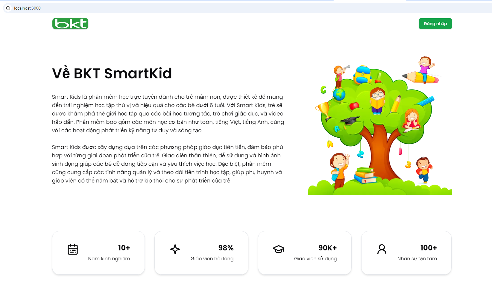
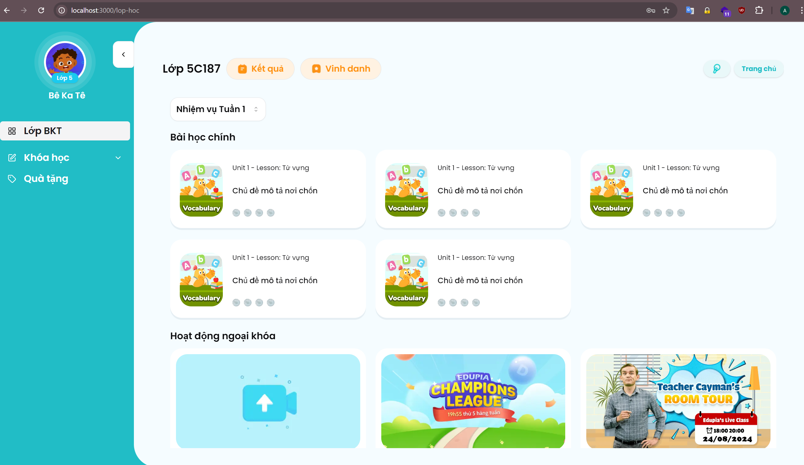

# SmartKids-TVMN

Trang web dạy học cho trẻ mầm non, trẻ mầm non có thể học, phát triển trí tuệ thông qua trò chơi giáo dục.

Trang này sẽ thay thế cho smart kid tiếng anh cũ (dựa theo cấu trúc cây của edupia.vn). Dự kiến sẽ là smart kid cho mọi môn học.

## Hình ảnh minh họa




## For Development

```sh
npm install
npm run dev
```

## For Production

```sh
npm install
npm run build
```